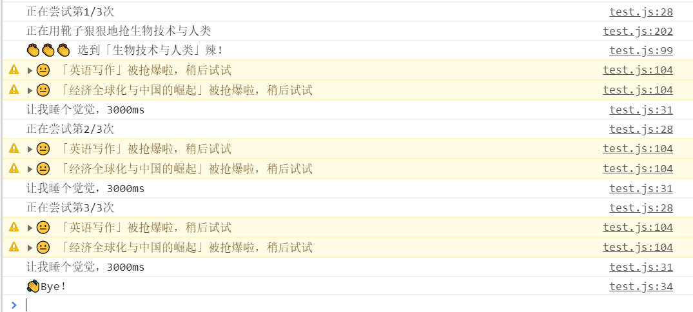

# SJTU 选课魔咒

## 功能✌

- 通过魔法让当前筛选条件下完整的课程列表显形
- 在 Console 中显示所有教学班信息
- 魔法抢课

## 使用说明

1. 在 Chrome 中进入开发者模式
2. 在 `Sources` 下的 `Snippets` 中，点击 `+ New Snippet`，创建一个代码片段
3. 将 `main.js` 文件中的全部内容复制进去~
4. 根据需要**修改配置🎨**
5. 心中默念魔咒，运行🍻

**注意事项👀**：  

- 这个脚本太菜了，只能抢已经在当前页面上列出来的课。可以通过多开几个标签页解决。
- 还没有异常处理，需要确保选课时间无冲突等意外情况2333

## 配置说明

配置项在文件开头定义的 `config` JSON对象中。

| 配置项 | 说明 |
|---|---|
| times  | 运行次数  |
| taskInterval  | 每次运行之间的间隔  |
| i_ve_read_this | 改为 `true` 才会运行 |
| targetList | 一个数组，包含所有待抢的课。其中的元素为教学班的代码 |

## 截图

